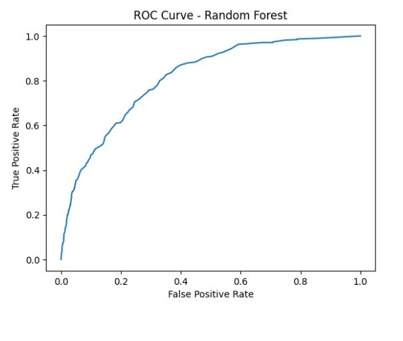
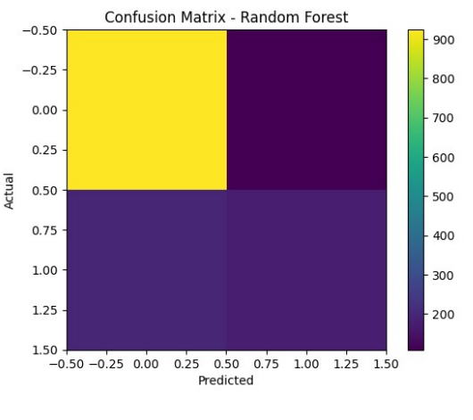

# Customer Churn Prediction using Machine Learning

[](https://colab.research.google.com/drive/1-TPzLjqoYMORqik0BgdspOs6pdnygeHZ?usp=sharing)

This project predicts telecom customer churn using machine learning techniques.  
Customer churn refers to customers leaving a service provider. Predicting churn helps companies take proactive actions to retain customers and reduce revenue loss.

---

## Dataset

This project uses the **Telco Customer Churn dataset**.

📊 Dataset Source  
https://www.kaggle.com/code/basmalaawad/telco-customer-churn-dataset

Dataset Characteristics:

- 7043 customer records
- 21 features
- Target variable: **Churn (Yes/No)**

The dataset includes:

- Customer demographics
- Service subscription details
- Billing information
- Contract type
- Payment methods

---

## Machine Learning Models

Two supervised machine learning algorithms were implemented.

### Logistic Regression
A baseline linear classification model used for binary prediction.

### Random Forest
An ensemble learning algorithm that builds multiple decision trees and combines their predictions.

---

## Data Preprocessing

The following preprocessing steps were performed:

- Removed irrelevant column **customerID**
- Converted **TotalCharges** column to numeric
- Handled missing values
- Applied **Label Encoding** for categorical variables
- Applied **StandardScaler** for feature scaling
- Split dataset into **80% training and 20% testing**

---

## Results

| Model | Accuracy |
|------|---------|
| Logistic Regression | 78.5% |
| Random Forest | 78.2% |

---

## Evaluation Metrics

The models were evaluated using:

- Accuracy
- Precision
- Recall
- F1 Score
- ROC-AUC Score

---

## Visualizations

### ROC Curve



### Confusion Matrix



These visualizations help evaluate model performance and classification behavior.

---

## Technologies Used

- Python
- Pandas
- NumPy
- Scikit-learn
- Matplotlib
- Google Colab / Jupyter Notebook

---

## Requirements

To run this project locally install dependencies:

```
pip install pandas numpy scikit-learn matplotlib seaborn jupyter
```

---

## Project Structure

```
customer-churn-prediction-ml
│
├── Customer_Churn_Prediction.ipynb
├── Telco-Customer-Churn.csv
├── Customer_Churn_Prediction_Report.pdf
├── ROC.png
├── CONFUSION_MATRIX.png
└── README.md
```

---

## Business Impact

Predicting customer churn helps companies:

- Identify customers at risk of leaving
- Offer personalized retention strategies
- Improve customer satisfaction
- Reduce long-term revenue loss

---

## Author

**Abhinav Saha**  
Computer Engineering Student  
Thapar Institute of Engineering & Technology
